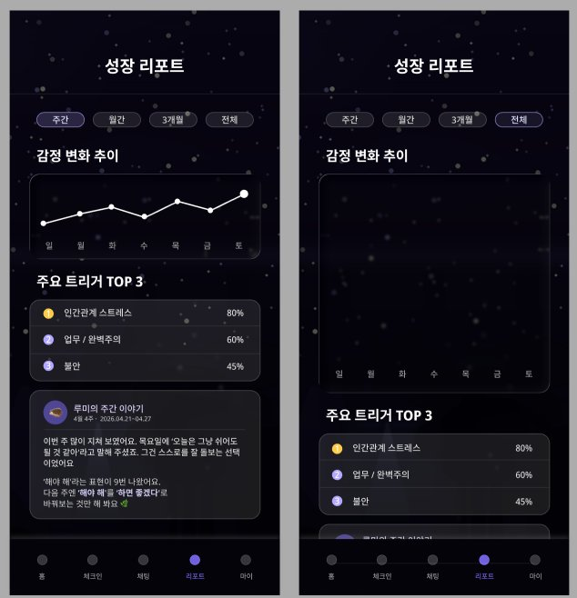

# AI 정서 케어 앱 — 프론트엔드 설계 계획 문서

> 작성일: 2026-05-07  
> 플랫폼: React Native + Expo  
> 상태: 초안 (v0.1)

---

## 1. 프로젝트 개요

AI 기반 정서 케어 모바일 애플리케이션. 사용자가 감정을 기록하고, AI 캐릭터와 CBT 기반 대화를 나누며, 감정 변화 추이를 리포트로 확인하는 서비스.

### 핵심 사용자 플로우

```
소셜 로그인 → 온보딩 (감정/고민/대화방식/캐릭터 선택)
  └→ 홈 (감정 별자리, 체크인, 마음탐색, 리포트, TODO)
       ├→ 체크인 (감정 선택 → 강도 → 일기)
       ├→ 채팅 (AI 캐릭터 대화 → CBT 생각 재구성)
       ├→ 리포트 (감정 추이 그래프 + 트리거 분석)
       ├→ 마음 탐색 (스토리형 심리 테스트 → 결과)
       └→ 마이페이지 (파트너 변경, 설정)
```

---

## 2. 기술 스택

### 코어

| 분류 | 기술 | 선택 이유 |
|---|---|---|
| 프레임워크 | React Native + Expo SDK 51+ | 크로스플랫폼, 빠른 개발 사이클 |
| 언어 | TypeScript | 타입 안정성 |
| 네비게이션 | React Navigation | 높은 유연성, 쉬운 사용법 |
| 상태 관리 | Zustand | 경량, 보일러플레이트 없음 |
| 서버 통신 | TanStack Query v5 | 캐싱, 낙관적 업데이트, 무한스크롤 |
| 스타일링 | NativeWind | 다크 테마 우선 UI에 적합 |
| 애니메이션 | Reanimated 3 + Lottie | 감정 별자리, 페이드인 등 풍부한 모션 |
| 폼 관리 | React Hook Form + Zod | 체크인 일기, 온보딩 입력 검증 |
| 인증 자동 갱신 | TanStack Query + Axios 인터셉터 |

<br>

> Reanimated 3 -> 상호작용 애니매이션
>
> Lottie -> 영상형 애니매이션


### 기타

| 분류 | 기술 |
|---|---|
| 차트 | `victory-native` 또는 `react-native-gifted-charts` |
| 채팅 UI | 커스텀 FlatList |
| 슬라이더 | `@miblanchard/react-native-slider` |
| 아이콘 | `expo-vector-icons` (Ionicons) |
| 날짜 | `date-fns` |
| 환경변수 | `expo-constants` + `.env` |

---

## 3. 네비게이션 구조

Expo Router의 파일 기반 라우팅 기준.

```
app/
├── (auth)/                   # 비로그인 그룹
│   ├── login.tsx             # 소셜 로그인
│   └── onboarding/
│       ├── step1-emotion.tsx # 감정 선택
│       ├── step2-concern.tsx # 주요 고민
│       ├── step3-style.tsx   # 대화 방식
│       └── step4-character.tsx # 캐릭터 선택
│
├── (main)/                   # 로그인 후 탭 네비게이터
│   ├── _layout.tsx           # Bottom Tab Navigator
│   ├── home/
│   │   └── index.tsx
│   ├── checkin/
│   │   ├── index.tsx         # 오늘의 체크인
│   │   └── history.tsx       # 체크인 기록
│   ├── chat/
│   │   ├── index.tsx         # 메인 채팅
│   │   └── restructure.tsx   # 생각 재구성 상세
│   ├── report/
│   │   └── index.tsx
│   └── my/
│       ├── index.tsx
│       ├── partner.tsx       # 파트너 변경
│       └── settings.tsx
│
└── mind-explore/             # 모달 or 별도 스택
    ├── index.tsx             # 오프닝
    ├── [stageId].tsx         # 스토리 스테이지
    └── result.tsx            # 결과
```

---

## 4. 페이지별 상세 설계

---

### 4.1 온보딩


**진입 조건:** 최초 가입 시 1회만 진행. 완료 후 홈으로 리다이렉트.

#### 스텝 구성

| 스텝 | 화면명 | 핵심 UI | 선택 방식 |
|---|---|---|---|
| 1/3 | 감정 선택 | 감정 목록 라디오 | 단일 선택 |
| 2/3 | 주요 고민 | 칩(Chip) 목록 | 최대 3개 다중 선택 |
| 3/3 | 대화 방식 | 카드 선택 | 단일 선택 (공감형/분석형/해결형/균형형) |
| - | 캐릭터 선택 | 캐릭터 카드 그리드 | 단일 선택 + 확인 버튼 |

#### 주요 컴포넌트

```
OnboardingLayout
  ├── ProgressBar              # 1/3, 2/3, 3/3 표시
  ├── StepQuestion             # 질문 텍스트 + 서브 설명
  ├── EmotionRadioList         # 스텝 1 - 이모지 + 감정 라디오
  ├── ConcernChipGroup         # 스텝 2 - 선택 칩 (max 3)
  ├── ConversationStyleCard    # 스텝 3 - 해시태그 + 설명 카드
  └── CharacterSelectGrid      # 캐릭터 카드 (이름, 유형, 설명)
```

#### 상태 관리

```typescript
// Zustand - onboardingStore
interface OnboardingState {
  emotion: string | null
  concerns: string[]         // max 3
  conversationStyle: 'empathy' | 'analysis' | 'solution' | 'balanced' | null
  selectedCharacter: CharacterId | null
  currentStep: 1 | 2 | 3 | 4
}
```

#### 데이터 의존성

```typescript
// TanStack Query
useQuery(['characters'])                  // 캐릭터 목록 (정적 데이터, staleTime: Infinity)
useMutation(['onboarding', 'submit'])     // 온보딩 완료 → 서버 저장 후 홈 리다이렉트
```

---

### 4.2 홈


**네비게이션:** `/(main)/home/index`

#### 구성 섹션

| 섹션 | 기능 |
|---|---|
| 헤더 | 유저 닉네임 + 인사 텍스트 |
| 감정 별자리 | 감정 데이터 기반 별 배치 애니메이션 (Reanimated) |
| 오늘의 체크인 | 미완료: 이모지 5개 선택 UI / 완료: 선택된 감정 강조 표시 → 체크인 화면 이동 |
| 마음 탐색 | 배지(스토리 분석 태그) + → 마음 탐색 진입 |
| 기록 | 과거 체크인/생각 리스트 미리보기 → 체크인 히스토리 이동 |
| TODO | 체크리스트 현황 표시 + 설정 이동 |

#### 주요 컴포넌트

```
HomeScreen
  ├── HomeHeader               # "안녕하세요 {닉네임} 님" + 날짜
  ├── ConstellationView        # 별자리 SVG 애니메이션 + 꺾은선 그래프
  ├── TodayCheckinCard
  │   ├── EmotionQuickSelect   # 이모지 5개 (미완료 상태)
  │   └── CheckedEmotionBadge  # 완료된 감정 표시
  ├── MindExploreCard          # 마음 탐색 배너 카드
  ├── RecordPreviewCard        # 기록 미리보기
  └── TodoCard
       ├── TodoItem            # 체크박스 + 텍스트
       └── TodoSettingButton
```

#### 데이터 의존성

```typescript
// TanStack Query
useQuery(['home', 'checkin-today'])     // 오늘 체크인 여부
useQuery(['home', 'constellation'])     // 최근 7일 감정 데이터
useQuery(['home', 'todos'])             // TODO 목록
```

---

### 4.3 체크인


**네비게이션:** `/(main)/checkin/index` + `/(main)/checkin/history`

#### 오늘의 체크인 플로우

```
감정 선택 (이모지 5종)
  → 감정 강도 입력 (슬라이더 0~100)
  → 오늘 하루 어땠는지 텍스트 입력 (선택, 200자)
  → 완료 버튼
```

#### 체크인 기록 화면

- 탭: 오늘의 체크인 | 기록
- 기록 목록: 날짜별 카드 (이모지 + 감정명 + 일기 미리보기)
- 미완료 상태: 달 일러스트 + "오늘의 감정을 기록하세요" CTA

#### 주요 컴포넌트

```
CheckinScreen
  ├── CheckinHeader            # 날짜 + 요일
  ├── EmotionSelector          # 이모지 5종 선택 (happy/calm/neutral/anxious/tired)
  ├── IntensitySlider          # 0~100 슬라이더, 중앙 숫자 표시
  ├── DiaryTextInput           # 멀티라인 TextInput (200자 제한)
  └── CompleteButton

CheckinHistoryScreen
  ├── CheckinTabs              # 오늘의 체크인 | 기록
  ├── EmptyState               # 미체크인 시 달 일러스트
  └── CheckinHistoryList
       └── CheckinHistoryItem  # 날짜 + 이모지 + 감정 + 미리보기 텍스트
```

#### 데이터 의존성

```typescript
// TanStack Query
useQuery(['checkin', 'today'])               // 오늘 체크인 기록 조회 (완료 여부 + 선택 감정)
useInfiniteQuery(['checkin', 'history'])     // 과거 체크인 목록 (날짜 내림차순 페이지네이션)
useMutation(['checkin', 'create'])           // 체크인 저장 → 홈 today 캐시 무효화
```

---

### 4.4 채팅


**네비게이션:** `/(main)/chat/index` + `/(main)/chat/restructure`

#### 채팅 메인 기능

| 기능 | 설명 |
|---|---|
| AI 캐릭터 대화 | 온보딩에서 선택한 캐릭터와 실시간 대화 (스트리밍) |
| 인지 왜곡 감지 배너 | AI가 감지 시 "지금 생각 재구성을 해볼까요?" 인라인 카드 노출 |
| 감정 강도 감지 | 대화 중 "지금 느끼는 감정 강도" 슬라이더 인라인 표시 |
| 생각 재구성 제안 수락 | 미루기 / 건너뛰기 버튼 → 수락 시 restructure 화면 진입 |

#### 채팅 메시지 타입

```typescript
type MessageType =
  | 'text'                    // 일반 텍스트 버블
  | 'ai-text'                 // AI 응답 버블
  | 'restructure-prompt'      // 생각 재구성 제안 카드
  | 'emotion-intensity'       // 감정 강도 슬라이더 카드
  | 'typing'                  // 타이핑 인디케이터
```

#### 생각 재구성 화면 구성

```
RestructureScreen
  ├── RestructureHeader        # ← 뒤로가기
  ├── OriginalThoughtCard      # "내가 가진 생각" (사용자 말 인용)
  ├── CharacterQuestionCard    # "루미의 질문"
  ├── AlternativeThoughtCard   # "대안 생각" (AI 생성, 그린 배경)
  ├── EmotionSlider            # "다시 느끼는 감정은?" 0~100
  └── SaveButton               # 변화 저장하기 / 저장 완료
```

#### 주요 컴포넌트

```
ChatScreen
  ├── ChatHeader               # 캐릭터명 + 온라인 dot + 클라우드 아이콘
  ├── ChatMessageList          # FlatList 역방향
  │   ├── TextBubble           # 사용자 / AI 버블
  │   ├── RestructurePromptCard
  │   └── EmotionIntensityCard # 슬라이더 인라인 카드
  ├── TypingIndicator          # 말풍선 애니메이션 3점
  └── ChatInput
       ├── TextInput
       └── SendButton

RestructureScreen
  ├── OriginalThoughtCard
  ├── CharacterQuestionCard
  ├── AlternativeThoughtCard
  ├── IntensitySlider
  └── SaveButton
```

#### 데이터 의존성

```typescript
// TanStack Query
useQuery(['chat', 'character'])              // 현재 선택 캐릭터 정보 (이름, 아바타)
useInfiniteQuery(['chat', 'messages'])       // 대화 히스토리 (역방향 페이지네이션)
useMutation(['chat', 'send'])                // 메시지 전송 (SSE 스트리밍 응답)
useMutation(['chat', 'restructure', 'save']) // 생각 재구성 결과 저장
```

---

### 4.5 리포트



**네비게이션:** `/(main)/report/index`

#### 구성 섹션

| 섹션 | 기능 |
|---|---|
| 기간 탭 | 주간 / 월간 / 3개월 / 전체 |
| 감정 변화 추이 | 꺾은선 그래프 (x: 요일/날짜, y: 감정 강도) |
| 주요 트리거 TOP 3 | 바 차트 형태, 퍼센트 + 트리거명 |
| 캐릭터 주간 이야기 | 캐릭터 아이콘 + 날짜 + AI 생성 주간 요약 텍스트 |

#### 주요 컴포넌트

```
ReportScreen
  ├── ReportHeader
  ├── PeriodTabBar             # 주간/월간/3개월/전체
  ├── EmotionTrendChart        # victory-native LineChart
  │   └── EmptyChartState      # 데이터 없을 때
  ├── TriggerTopList
  │   └── TriggerItem          # 순위 번호 + 트리거명 + 퍼센트 바
  └── CharacterWeeklyStory
       ├── CharacterAvatar
       ├── StoryDateRange
       └── StoryText
```

#### 데이터 의존성

```typescript
// TanStack Query
useQuery(['report', period, 'trend'])        // 기간별 감정 강도 추이 (꺾은선 그래프 데이터)
useQuery(['report', period, 'triggers'])     // 기간별 트리거 TOP 3 + 퍼센트
useQuery(['report', 'story', 'weekly'])      // 캐릭터 주간 이야기 (AI 생성 텍스트)
```

---

### 4.6 마이페이지

**네비게이션:** `/(main)/my/index`

#### 구성 항목

| 항목 | 기능 |
|---|---|
| 프로필 | 닉네임, 현재 파트너 캐릭터 |
| 파트너 변경 | 캐릭터 선택 화면 재진입 |
| 알림 설정 | 체크인 리마인더, 채팅 알림 토글 |
| 계정 설정 | 로그아웃, 회원탈퇴 |
| 앱 정보 | 버전, 개인정보처리방침, 이용약관 |

#### 주요 컴포넌트

```
MyScreen
  ├── ProfileCard              # 닉네임 + 캐릭터 아바타
  ├── SettingSection
  │   ├── PartnerChangeRow     # → partner.tsx 이동
  │   ├── NotificationRow      # 알림 설정 토글
  │   └── AccountSection       # 로그아웃, 탈퇴
  └── AppInfoSection
```

#### 데이터 의존성

```typescript
// TanStack Query
useQuery(['my', 'profile'])                  // 유저 닉네임 + 현재 파트너 캐릭터
useQuery(['my', 'settings'])                 // 알림 설정 (체크인 리마인더, 채팅 알림 토글 상태)
useMutation(['my', 'partner', 'update'])     // 파트너 변경 → profile 캐시 무효화
useMutation(['my', 'account', 'logout'])     // 로그아웃 → 전체 쿼리 캐시 초기화
```

---

### 4.7 마음 탐색


**진입:** 홈 → 마음 탐색 카드 탭  
**네비게이션:** 모달 스택 (`/mind-explore/`)

#### 스테이지 플로우

| 스테이지 | 화면 | 설명 |
|---|---|---|
| Stage 01 | 오프닝 | 페이드인 텍스트 연출 |
| Stage 01 | 세계관 진입 | 분위기 설명 텍스트 |
| Stage 01 | 닉네임 입력 | 텍스트 인풋 |
| Stage 01 | 닉네임 확인 | "좋아요, {닉네임}, 같이 볼게요" |
| Stage 02 | 장소 선택 | 4개 선택지 카드 |
| ... | 이후 스테이지 | 분기별 스토리 진행 |
| 결과 | 결과 화면 | 어울리는 상담 캐릭터 추천 + 성향 분석 |

#### 주요 컴포넌트

```
MindExploreScreen (오프닝)
  └── FadeInText               # 연속 텍스트 페이드인 애니메이션

StageScreen
  ├── StageNarration           # 스토리 텍스트
  ├── NicknameInput            # 닉네임 입력 스테이지
  └── ChoiceList
       └── ChoiceCard          # 선택지 버튼

ResultScreen
  ├── CharacterRecommendCard   # 추천 캐릭터 + 이유
  ├── PersonalityAnalysis      # 성향 분석 텍스트
  └── ActionButtons            # 이 캐릭터로 시작하기 / 닫기
```

#### 상태 관리

```typescript
// Zustand - mindExploreStore
interface MindExploreState {
  sessionId: string
  nickname: string
  currentStageId: string
  choices: Record<string, string>  // stageId: choiceId
  result: MindExploreResult | null
}
```

#### 데이터 의존성

```typescript
// TanStack Query
useQuery(['mind-explore', 'stages'])                   // 스테이지 시나리오 데이터 (정적, staleTime: Infinity)
useMutation(['mind-explore', 'session', 'submit'])     // 선택 제출 → 다음 스테이지 분기 응답
useQuery(['mind-explore', 'result', sessionId])        // 최종 결과 조회 (추천 캐릭터 + 성향 분석)
```

---

## 5. 공통 컴포넌트 (Shared)

> **기준:** UI 원시(버튼·인풋), 앱 전반 디자인 언어(GlassCard), 2곳 이상에서 완전히 동일한 동작이 필요한 것만 공통으로 분리. 그 외 단일 화면 전용이거나 화면마다 커스터마이징이 더 중요한 컴포넌트는 페이지 로컬로 유지.

### 5.1 컴포넌트 사용처 교차 참조

| 컴포넌트 | 온보딩 | 홈 | 체크인 | 채팅 | 리포트 | 마이페이지 | 마음탐색 |
|---|:---:|:---:|:---:|:---:|:---:|:---:|:---:|
| Button (Primary/Secondary/Icon) | ✓ | ✓ | ✓ | ✓ | ✓ | ✓ | ✓ |
| TextInput / MultilineInput | ✓ | | ✓ | ✓ | | | ✓ |
| GlassCard | ✓ | ✓ | ✓ | ✓ | ✓ | | ✓ |
| IntensitySlider | | | ✓ | ✓ | | | |
| CharacterAvatar | ✓ | | | ✓ | ✓ | ✓ | ✓ |
| EmotionEmoji / EmojiRow | ✓ | ✓ | ✓ | | | | |

---

### 5.2 컴포넌트 트리

```
components/
├── ui/
│   ├── Button/
│   │   ├── PrimaryButton.tsx
│   │   ├── SecondaryButton.tsx
│   │   └── IconButton.tsx
│   │
│   ├── Input/
│   │   ├── TextInput.tsx
│   │   └── MultilineInput.tsx
│   │
│   ├── Card/
│   │   └── GlassCard.tsx          # 다크 반투명 카드 베이스
│   │                               #   → 온보딩/홈/체크인/채팅/리포트/마음탐색
│   │
│   └── Slider/
│       └── IntensitySlider.tsx    # 0~100, 중앙 숫자 표시
│                                   #   → 체크인 강도 입력, 채팅 EmotionIntensityCard,
│                                   #     생각 재구성 슬라이더
│
├── layout/
│   ├── ScreenContainer.tsx        # SafeAreaView + 배경
│   ├── StarBackground.tsx         # 별 파티클 배경
│   └── KeyboardAwareView.tsx
│
├── character/
│   └── CharacterAvatar.tsx        # 캐릭터 아이콘 (size: sm|md|lg)
│                                   #   → 온보딩/리포트/마이페이지/채팅/마음탐색
│
└── emotion/
    ├── EmotionEmoji.tsx           # 감정 이모지 단일
    └── EmotionEmojiRow.tsx        # 5개 이모지 행
                                    #   → 온보딩/홈/체크인
```

> **페이지 로컬 컴포넌트 예시** (공통으로 올리지 않음):  
> TabBar, PageHeader, SelectableChip, SelectableCard, TagBadge, StepProgressBar,  
> EmptyState, ListItemRow, ToggleSwitch, ButtonGroup, AvatarInfoRow,  
> MessageBubble, TypingIndicator, OnlineIndicator, FadeInText, CharacterCard

---

## 6. 폴더 구조 (전체)

```
📦 project-root/
├── app/                          # Expo Router 라우트
│   ├── (auth)/
│   │   ├── login.tsx
│   │   └── onboarding/
│   │       ├── _layout.tsx
│   │       ├── step1-emotion.tsx
│   │       ├── step2-concern.tsx
│   │       ├── step3-style.tsx
│   │       └── step4-character.tsx
│   ├── (main)/
│   │   ├── _layout.tsx           # Tab Navigator
│   │   ├── home/index.tsx
│   │   ├── checkin/
│   │   │   ├── index.tsx
│   │   │   └── history.tsx
│   │   ├── chat/
│   │   │   ├── index.tsx
│   │   │   └── restructure.tsx
│   │   ├── report/index.tsx
│   │   └── my/
│   │       ├── index.tsx
│   │       ├── partner.tsx
│   │       └── settings.tsx
│   ├── mind-explore/
│   │   ├── _layout.tsx           # 모달 스택
│   │   ├── index.tsx
│   │   ├── [stageId].tsx
│   │   └── result.tsx
│   └── _layout.tsx               # Root layout (AuthGuard)
│
├── src/
│   ├── components/               # 위 5번 참조
│   │   ├── ui/
│   │   ├── layout/
│   │   ├── character/
│   │   └── emotion/
│   │
│   ├── stores/                   # Zustand stores
│   │   ├── authStore.ts
│   │   ├── onboardingStore.ts
│   │   ├── chatStore.ts
│   │   ├── checkinStore.ts
│   │   └── mindExploreStore.ts
│   │
│   ├── queries/                  # TanStack Query hooks
│   │   ├── useAuth.ts
│   │   ├── useCheckin.ts
│   │   ├── useChat.ts
│   │   ├── useReport.ts
│   │   └── useMindExplore.ts
│   │
│   ├── api/                      # Axios 클라이언트 + API 함수
│   │   ├── client.ts             # Axios 인스턴스 + 인터셉터
│   │   ├── auth.api.ts
│   │   ├── checkin.api.ts
│   │   ├── chat.api.ts
│   │   ├── report.api.ts
│   │   └── mindExplore.api.ts
│   │
│   ├── types/                    # 공통 TypeScript 타입
│   │   ├── auth.types.ts
│   │   ├── emotion.types.ts
│   │   ├── chat.types.ts
│   │   ├── report.types.ts
│   │   └── character.types.ts
│   │
│   ├── constants/
│   │   ├── emotions.ts           # 감정 이모지 + 감정명 매핑
│   │   ├── characters.ts         # 캐릭터 데이터
│   │   └── colors.ts             # 디자인 토큰
│   │
│   ├── hooks/                    # 커스텀 훅
│   │   ├── useAuth.ts
│   │   ├── useKeyboard.ts
│   │   └── useDebounce.ts
│   │
│   └── utils/
│       ├── date.ts               # date-fns 래퍼
│       ├── storage.ts            # expo-secure-store 래퍼
│       └── format.ts
│
├── assets/
│   ├── images/
│   ├── animations/               # Lottie JSON
│   └── fonts/
│
├── app.json
├── babel.config.js
├── tsconfig.json
└── package.json
```

---

## 7. 상태 관리 설계

### Zustand Store 책임 분리

| Store | 관리 상태 | 비고 |
|---|---|---|
| `authStore` | 유저 정보, 액세스 토큰, 인증 상태 | SecureStore 연동 |
| `onboardingStore` | 온보딩 스텝별 선택값 | 완료 후 서버 저장 + 초기화 |
| `chatStore` | 현재 세션 메시지 목록, 타이핑 상태, 재구성 제안 상태 | 실시간 업데이트 |
| `checkinStore` | 오늘 체크인 임시 입력값 | 완료 후 초기화 |
| `mindExploreStore` | 탐색 세션, 스테이지별 선택, 결과 | 탐색 종료 후 초기화 |

### Zustand Store 상세 인터페이스

#### authStore

```typescript
interface AuthState {
  // 상태
  userId: string | null
  nickname: string | null
  accessToken: string | null
  isAuthenticated: boolean
  // 액션
  setAuth: (userId: string, nickname: string, accessToken: string) => void
  setAccessToken: (token: string) => void   // Axios 인터셉터에서 토큰 갱신 시 호출
  logout: () => void                         // 상태 초기화 + SecureStore 삭제
}
```

#### onboardingStore

```typescript
interface OnboardingState {
  // 상태
  emotion: string | null
  concerns: string[]                          // max 3
  conversationStyle: 'empathy' | 'analysis' | 'solution' | 'balanced' | null
  selectedCharacter: CharacterId | null
  currentStep: 1 | 2 | 3 | 4
  // 액션
  setEmotion: (emotion: string) => void
  toggleConcern: (concern: string) => void    // 추가/제거 토글, max 3 초과 시 무시
  setConversationStyle: (style: ConversationStyle) => void
  setCharacter: (characterId: CharacterId) => void
  nextStep: () => void
  prevStep: () => void
  reset: () => void                           // 온보딩 완료 후 서버 저장 뒤 호출
}
```

#### chatStore

```typescript
interface ChatMessage {
  id: string
  type: MessageType                           // 'text' | 'ai-text' | 'restructure-prompt' | 'emotion-intensity' | 'typing'
  content: string
  sender: 'user' | 'ai'
  createdAt: Date
}

interface RestructurePrompt {
  triggerMessageId: string                    // 재구성 제안을 트리거한 메시지 ID
  originalThought: string                     // 사용자 발화 인용
  aiQuestion: string                          // AI의 CBT 질문
  alternativeThought: string                  // AI가 생성한 대안 생각
}

interface ChatState {
  // 상태
  messages: ChatMessage[]                     // 현재 세션 메시지 (히스토리 로드 후 append)
  isTyping: boolean                           // AI 응답 대기 중
  streamingMessageId: string | null           // 현재 스트리밍 수신 중인 AI 메시지 ID
  restructurePrompt: RestructurePrompt | null // 인라인 재구성 제안 카드 데이터
  // 액션
  addMessage: (message: ChatMessage) => void
  appendStreamChunk: (messageId: string, chunk: string) => void  // SSE 청크 수신 시 해당 메시지에 append
  setTyping: (isTyping: boolean) => void
  setRestructurePrompt: (prompt: RestructurePrompt | null) => void
  reset: () => void
}
```

#### checkinStore

```typescript
type EmotionType = 'happy' | 'calm' | 'neutral' | 'anxious' | 'tired'
type CheckinStep = 'emotion' | 'intensity' | 'diary'

interface CheckinState {
  // 상태
  selectedEmotion: EmotionType | null
  intensity: number                           // 0~100, 기본값 50
  diaryText: string
  currentStep: CheckinStep
  // 액션
  setEmotion: (emotion: EmotionType) => void
  setIntensity: (value: number) => void
  setDiaryText: (text: string) => void
  nextStep: () => void
  prevStep: () => void
  reset: () => void                           // 체크인 저장 완료 후 호출
}
```

#### mindExploreStore

```typescript
interface MindExploreResult {
  recommendedCharacterId: CharacterId
  recommendedCharacterReason: string
  personalityAnalysis: string
}

interface MindExploreState {
  // 상태
  sessionId: string | null
  nickname: string
  currentStageId: string | null
  choices: Record<string, string>             // stageId → choiceId
  result: MindExploreResult | null
  // 액션
  initSession: (sessionId: string) => void
  setNickname: (nickname: string) => void
  setChoice: (stageId: string, choiceId: string) => void
  setCurrentStage: (stageId: string) => void
  setResult: (result: MindExploreResult) => void
  reset: () => void                           // 탐색 종료(닫기) 후 호출
}
```

---

### 페이지별 Zustand 의존성 맵

> **범례:** R = 읽기(구독), W = 액션 호출(쓰기)

---

#### `app/_layout.tsx` — Root Layout (AuthGuard)

| Store | 필드 / 액션 | R/W | 용도 |
|---|---|:---:|---|
| authStore | `isAuthenticated` | R | 로그인 여부에 따라 `(auth)` / `(main)` 그룹 분기 |

---

#### `app/(auth)/login.tsx`

| Store | 필드 / 액션 | R/W | 용도 |
|---|---|:---:|---|
| authStore | `isAuthenticated` | R | 이미 로그인 상태면 홈으로 리다이렉트 |
| authStore | `setAuth()` | W | 소셜 로그인 성공 후 userId·nickname·accessToken 저장 |

---

#### `app/(auth)/onboarding/step1-emotion.tsx`

| Store | 필드 / 액션 | R/W | 용도 |
|---|---|:---:|---|
| onboardingStore | `emotion` | R | 선택된 감정 라디오 강조 표시 |
| onboardingStore | `currentStep` | R | ProgressBar `1/3` 표시 |
| onboardingStore | `setEmotion()` | W | 감정 라디오 선택 시 |
| onboardingStore | `nextStep()` | W | 다음 버튼 탭 시 |

---

#### `app/(auth)/onboarding/step2-concern.tsx`

| Store | 필드 / 액션 | R/W | 용도 |
|---|---|:---:|---|
| onboardingStore | `concerns` | R | 선택된 칩 강조 표시 / 최대 3개 카운트 |
| onboardingStore | `currentStep` | R | ProgressBar `2/3` 표시 |
| onboardingStore | `toggleConcern()` | W | 칩 선택·해제 시 |
| onboardingStore | `nextStep()` | W | 다음 버튼 탭 시 |
| onboardingStore | `prevStep()` | W | 뒤로가기 버튼 탭 시 |

---

#### `app/(auth)/onboarding/step3-style.tsx`

| Store | 필드 / 액션 | R/W | 용도 |
|---|---|:---:|---|
| onboardingStore | `conversationStyle` | R | 선택된 대화 방식 카드 강조 표시 |
| onboardingStore | `currentStep` | R | ProgressBar `3/3` 표시 |
| onboardingStore | `setConversationStyle()` | W | 대화 방식 카드 선택 시 |
| onboardingStore | `nextStep()` | W | 다음 버튼 탭 시 |
| onboardingStore | `prevStep()` | W | 뒤로가기 버튼 탭 시 |

---

#### `app/(auth)/onboarding/step4-character.tsx`

| Store | 필드 / 액션 | R/W | 용도 |
|---|---|:---:|---|
| onboardingStore | `selectedCharacter` | R | 선택된 캐릭터 카드 강조 표시 |
| onboardingStore | `emotion`, `concerns`, `conversationStyle` | R | 서버 저장 mutation 페이로드 조합 |
| onboardingStore | `setCharacter()` | W | 캐릭터 카드 선택 시 |
| onboardingStore | `reset()` | W | `useMutation` 성공 콜백에서 호출 (스토어 초기화) |

---

#### `app/(main)/home/index.tsx`

| Store | 필드 / 액션 | R/W | 용도 |
|---|---|:---:|---|
| authStore | `nickname` | R | `HomeHeader` — "안녕하세요 {닉네임} 님" |

> 나머지 홈 데이터(체크인 여부, 별자리, TODO)는 모두 TanStack Query로 처리.

---

#### `app/(main)/checkin/index.tsx`

| Store | 필드 / 액션 | R/W | 용도 |
|---|---|:---:|---|
| checkinStore | `currentStep` | R | 현재 입력 단계(`emotion` / `intensity` / `diary`) UI 전환 |
| checkinStore | `selectedEmotion` | R | `EmotionSelector` 선택 상태 표시 |
| checkinStore | `intensity` | R | `IntensitySlider` 현재 값 표시 |
| checkinStore | `diaryText` | R | `DiaryTextInput` 현재 텍스트 |
| checkinStore | `setEmotion()` | W | 이모지 선택 시 |
| checkinStore | `setIntensity()` | W | 슬라이더 드래그 시 |
| checkinStore | `setDiaryText()` | W | 텍스트 입력 시 |
| checkinStore | `nextStep()` | W | 단계 진행 버튼 탭 시 |
| checkinStore | `prevStep()` | W | 뒤로가기 탭 시 |
| checkinStore | `reset()` | W | `useMutation` 성공 콜백에서 호출 |

---

#### `app/(main)/checkin/history.tsx`

Zustand 의존 없음. TanStack Query(`useInfiniteQuery`)만 사용.

---

#### `app/(main)/chat/index.tsx`

| Store | 필드 / 액션 | R/W | 용도 |
|---|---|:---:|---|
| chatStore | `messages` | R | `ChatMessageList` 렌더링 |
| chatStore | `isTyping` | R | `TypingIndicator` 표시 여부 |
| chatStore | `streamingMessageId` | R | 스트리밍 진행 중인 버블 식별 (커서 애니메이션) |
| chatStore | `restructurePrompt` | R | `!= null` 이면 `RestructurePromptCard` 인라인 카드 노출 |
| chatStore | `addMessage()` | W | 사용자 메시지 전송 시 즉시 낙관적 추가 |
| chatStore | `appendStreamChunk()` | W | SSE 청크 수신마다 해당 AI 메시지 버블에 append |
| chatStore | `setTyping()` | W | 메시지 전송 후 `true`, AI 첫 청크 수신 시 `false` |
| chatStore | `setRestructurePrompt()` | W | AI 응답에 인지 왜곡 감지 플래그가 포함될 때 |

---

#### `app/(main)/chat/restructure.tsx`

| Store | 필드 / 액션 | R/W | 용도 |
|---|---|:---:|---|
| chatStore | `restructurePrompt.originalThought` | R | `OriginalThoughtCard` 사용자 발화 인용 |
| chatStore | `restructurePrompt.aiQuestion` | R | `CharacterQuestionCard` AI CBT 질문 |
| chatStore | `restructurePrompt.alternativeThought` | R | `AlternativeThoughtCard` AI 대안 생각 |
| chatStore | `setRestructurePrompt(null)` | W | 저장 완료(`useMutation` 성공) 후 카드 닫기 |

---

#### `app/(main)/report/index.tsx`

Zustand 의존 없음. 기간 탭 선택(`period`)은 `useState` 로컬 상태 처리, 데이터는 TanStack Query.

---

#### `app/(main)/my/index.tsx`

| Store | 필드 / 액션 | R/W | 용도 |
|---|---|:---:|---|
| authStore | `nickname` | R | `ProfileCard` 닉네임 표시 |
| authStore | `logout()` | W | 로그아웃 버튼 탭 → `useMutation` 성공 콜백에서 호출 |

---

#### `app/(main)/my/partner.tsx`

Zustand 직접 의존 없음. 파트너 변경은 `useMutation(['my', 'partner', 'update'])` 처리.

---

#### `app/(main)/my/settings.tsx`

Zustand 의존 없음. 알림 설정은 TanStack Query.

---

#### `app/mind-explore/index.tsx` — 오프닝

| Store | 필드 / 액션 | R/W | 용도 |
|---|---|:---:|---|
| mindExploreStore | `reset()` | W | 탐색 진입 시 이전 세션 초기화 |
| mindExploreStore | `initSession()` | W | 새 세션 ID 발급 후 저장 |

---

#### `app/mind-explore/[stageId].tsx`

| Store | 필드 / 액션 | R/W | 용도 |
|---|---|:---:|---|
| mindExploreStore | `sessionId` | R | mutation 페이로드 / 결과 쿼리 키 |
| mindExploreStore | `nickname` | R | 스토리 텍스트 보간 `"좋아요, {nickname}, 같이 볼게요"` |
| mindExploreStore | `currentStageId` | R | 현재 스테이지 확인 |
| mindExploreStore | `choices` | R | 이미 선택한 선택지 강조 표시 (이전 스테이지 복귀 시) |
| mindExploreStore | `setNickname()` | W | 닉네임 입력 스테이지에서 텍스트 확정 시 |
| mindExploreStore | `setChoice()` | W | 선택지 카드 탭 시 |
| mindExploreStore | `setCurrentStage()` | W | 다음 스테이지로 분기 이동 시 |

---

#### `app/mind-explore/result.tsx`

| Store | 필드 / 액션 | R/W | 용도 |
|---|---|:---:|---|
| mindExploreStore | `sessionId` | R | `useQuery(['mind-explore', 'result', sessionId])` 쿼리 키 |
| mindExploreStore | `result` | R | 추천 캐릭터 + 성향 분석 표시 (서버 응답 후 저장된 값) |
| mindExploreStore | `setResult()` | W | 결과 쿼리 성공 시 스토어에 캐시 |
| mindExploreStore | `reset()` | W | 닫기 버튼 탭 시 세션 초기화 |

---

### TanStack Query 캐시 전략

```typescript
// 캐시 시간 전략
const queryConfig = {
  'home-today':      { staleTime: 1000 * 60 * 5  },  // 5분
  'report-weekly':   { staleTime: 1000 * 60 * 10 },  // 10분
  'chat-history':    { staleTime: 0               },  // 항상 최신
  'characters':      { staleTime: Infinity         },  // 정적 데이터
}
```

---

## 8. 다음 설계 단계

- [ ] 컴포넌트 트리 Mermaid 다이어그램 (페이지별)
- [ ] API 명세 협의 (백엔드 팀)
- [ ] 디자인 토큰 확정 (색상, 타이포, 간격)
- [ ] 채팅 스트리밍 방식 확정 (SSE vs WebSocket)
- [ ] Figma 컴포넌트 라이브러리 구축
