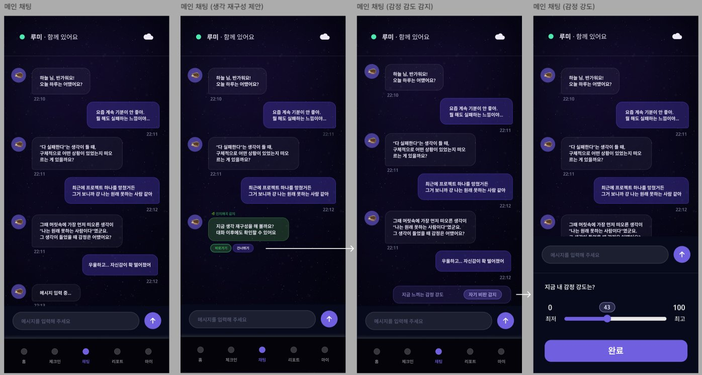
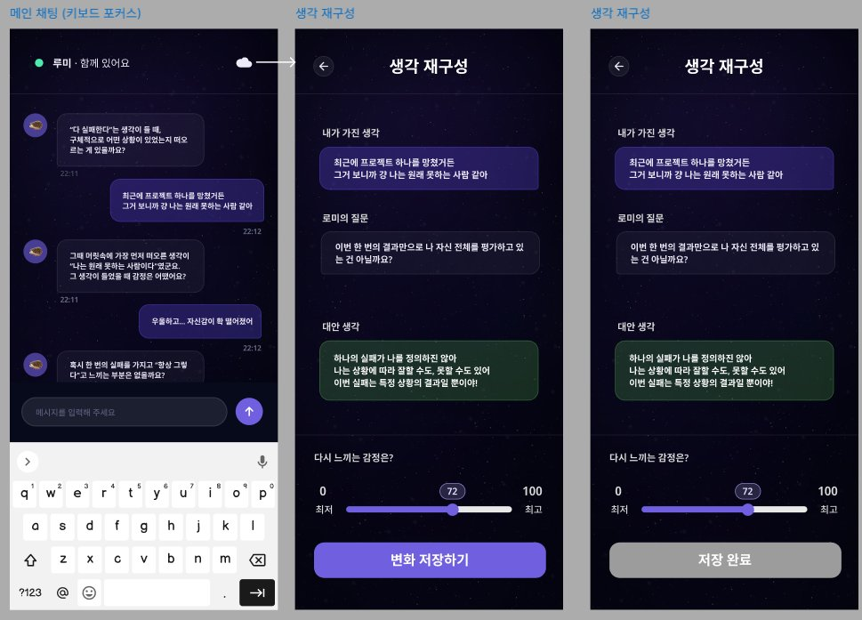

# 페이지 설계 — 채팅

> [← 인덱스로 돌아가기](./index.md)

**네비게이션:** `/(main)/chat/index` + `/(main)/chat/restructure`




---

## 채팅 메인 기능

| 기능 | 설명 |
|---|---|
| AI 캐릭터 대화 | 온보딩에서 선택한 캐릭터와 실시간 대화 (스트리밍) |
| 인지 왜곡 감지 배너 | AI가 감지 시 "지금 생각 재구성을 해볼까요?" 인라인 카드 노출 |
| 감정 강도 감지 | 대화 중 "지금 느끼는 감정 강도" 슬라이더 인라인 표시 |
| 생각 재구성 제안 수락 | 미루기 / 건너뛰기 버튼 → 수락 시 restructure 화면 진입 |

---

## 채팅 메시지 타입

```typescript
type MessageType =
  | 'text'                    // 일반 텍스트 버블
  | 'ai-text'                 // AI 응답 버블
  | 'restructure-prompt'      // 생각 재구성 제안 카드
  | 'emotion-intensity'       // 감정 강도 슬라이더 카드
  | 'typing'                  // 타이핑 인디케이터
```

---

## AI 응답 Delivery Mode

백엔드 Policy Engine이 메시지마다 전달 방식을 결정한다. 프론트엔드는 모든 모드를 처리할 수 있어야 한다.

| Delivery Mode | 응답 방식 | chatStore 처리 |
|---|---|---|
| `NORMAL_STREAM` | 즉시 SSE 스트리밍 | `appendStreamChunk()` |
| `SAFE_STREAM` | 안전 지침 주입 후 SSE 스트리밍 | `appendStreamChunk()` |
| `BUFFER_AND_JUDGE` | 전체 응답 생성 후 단일 전달 | `addSingleResponse()` |
| `SECURITY_REFUSAL` | 고정 보안 거절 메시지 즉시 전달 | `addSingleResponse()` |
| `CRISIS_FLOW` | 위기 안내 메시지 즉시 전달 | `addSingleResponse()` (링크 포함 가능) |

`BUFFER_AND_JUDGE` · `SECURITY_REFUSAL` · `CRISIS_FLOW`는 스트리밍 없이 완성된 메시지가 단일 이벤트로 도착한다.
`addSingleResponse()`로 처리하며 `streamingMessageId`는 설정하지 않는다 — 커서 애니메이션 없이 완성 버블로 즉시 표시된다.

---

## 생각 재구성 화면 구성

```
RestructureScreen
  ├── RestructureHeader        # ← 뒤로가기
  ├── OriginalThoughtCard      # "내가 가진 생각" (사용자 말 인용)
  ├── CharacterQuestionCard    # "루미의 질문"
  ├── AlternativeThoughtCard   # "대안 생각" (AI 생성, 그린 배경)
  ├── EmotionSlider            # "다시 느끼는 감정은?" 0~100
  └── SaveButton               # 변화 저장하기 / 저장 완료
```

---

## 주요 컴포넌트

```
ChatScreen
  ├── ChatHeader               # 캐릭터명 + 온라인 dot + 클라우드 아이콘
  ├── ChatMessageList          # FlatList 역방향
  │   ├── TextBubble           # 사용자 / AI 버블
  │   ├── RestructurePromptCard
  │   └── EmotionIntensityCard # 슬라이더 인라인 카드
  ├── TypingIndicator          # 말풍선 애니메이션 3점
  └── ChatInput
       ├── TextInput
       └── SendButton

RestructureScreen
  ├── OriginalThoughtCard
  ├── CharacterQuestionCard
  ├── AlternativeThoughtCard
  ├── IntensitySlider
  └── SaveButton
```

---

## 상태 관리 (Zustand)

#### `chat/index.tsx`

| Store | 필드 / 액션 | R/W | 용도 |
|---|---|:---:|---|
| chatStore | `messages` | R | `ChatMessageList` 렌더링 |
| chatStore | `isTyping` | R | `TypingIndicator` 표시 여부 |
| chatStore | `streamingMessageId` | R | 스트리밍 진행 중인 버블 식별 (커서 애니메이션) |
| chatStore | `restructurePrompt` | R | `!= null` 이면 `RestructurePromptCard` 인라인 카드 노출 |
| chatStore | `addMessage()` | W | 사용자 메시지 전송 시 즉시 낙관적 추가 |
| chatStore | `appendStreamChunk()` | W | SSE 청크 수신마다 해당 AI 메시지 버블에 append |
| chatStore | `setTyping()` | W | 메시지 전송 후 `true`, AI 첫 청크 수신 시 `false` |
| chatStore | `setRestructurePrompt()` | W | AI 응답에 인지 왜곡 감지 플래그가 포함될 때 |
| chatStore | `addSingleResponse()` | W | `BUFFER_AND_JUDGE`·`SECURITY_REFUSAL`·`CRISIS_FLOW` 응답 도착 시 — 스트리밍 없이 즉시 버블 추가 |

> `isTyping` 타임아웃 정책: 프론트엔드 자체 타임아웃은 설정하지 않는다. 서버 `proxy_read_timeout`(300s) 기준으로 연결이 끊어지기 전까지 `isTyping`을 유지한다. Risk 판단 중 응답이 최대 +2s 늦게 시작될 수 있으므로 느린 응답을 오류로 처리하지 않는다.

#### `chat/restructure.tsx`

| Store | 필드 / 액션 | R/W | 용도 |
|---|---|:---:|---|
| chatStore | `restructurePrompt.originalThought` | R | `OriginalThoughtCard` 사용자 발화 인용 |
| chatStore | `restructurePrompt.aiQuestion` | R | `CharacterQuestionCard` AI CBT 질문 |
| chatStore | `restructurePrompt.alternativeThought` | R | `AlternativeThoughtCard` AI 대안 생각 |
| chatStore | `setRestructurePrompt(null)` | W | 저장 완료(`useMutation` 성공) 후 카드 닫기 |

---

## SSE 통합 패턴 (useChatSSE 훅)

TanStack Query `useMutation`은 Promise 기반이므로 SSE 스트림과 직접 통합이 불가능하다.  
`@microsoft/fetch-event-source`를 사용하는 커스텀 훅 `useChatSSE`로 분리한다.

### 역할 분담

| 레이어 | 역할 |
|---|---|
| `useMutation(['chat', 'send'])` | 사용 안 함 — SSE 연결이 전송과 동시에 시작되므로 |
| `useChatSSE` 커스텀 훅 | 메시지 전송 + SSE 연결 + chatStore 업데이트 일괄 처리 |
| `useInfiniteQuery(['chat', 'messages'])` | 히스토리 로드 전용 (최초 진입·스크롤 상단) |
| `useMutation(['chat', 'restructure', 'save'])` | 재구성 결과 저장 전용 |

### useChatSSE 설계

```typescript
// src/queries/useChat.ts
function useChatSSE() {
  const abortControllerRef = useRef<AbortController | null>(null)
  const { addMessage, appendStreamChunk, addSingleResponse, setTyping, setConnected } = useChatStore()
  const { accessToken } = useAuthStore()

  const sendMessage = async (content: string) => {
    // 1. 이전 연결 취소
    abortControllerRef.current?.abort()
    const controller = new AbortController()
    abortControllerRef.current = controller

    // 2. 사용자 메시지 낙관적 추가
    const userMsg: ChatMessage = { id: uuid(), type: 'text', content, sender: 'user', createdAt: new Date() }
    addMessage(userMsg)
    setTyping(true)

    // 3. AI 응답용 플레이스홀더 메시지 생성
    const aiMsgId = uuid()

    try {
      await fetchEventSource('/conversations/messages', {
        method: 'POST',
        headers: { Authorization: `Bearer ${accessToken}`, 'Content-Type': 'application/json' },
        body: JSON.stringify({ content }),
        signal: controller.signal,
        onopen: async (res) => {
          setConnected(true)
          setTyping(false)
          // 스트리밍 모드인 경우 플레이스홀더 메시지 추가
          if (res.headers.get('content-type')?.includes('text/event-stream')) {
            addMessage({ id: aiMsgId, type: 'ai-text', content: '', sender: 'ai', createdAt: new Date() })
          }
        },
        onmessage: (event) => {
          const data = JSON.parse(event.data)
          if (data.type === 'chunk') {
            appendStreamChunk(aiMsgId, data.content)   // NORMAL_STREAM · SAFE_STREAM
          } else if (data.type === 'complete') {
            addSingleResponse({ id: aiMsgId, type: 'ai-text', content: data.content, sender: 'ai', createdAt: new Date() })
            // BUFFER_AND_JUDGE · SECURITY_REFUSAL · CRISIS_FLOW
          } else if (data.type === 'restructure') {
            setRestructurePrompt(data.prompt)           // CBT 감지 시 재구성 카드 노출
          }
        },
        onerror: () => {
          setConnected(false)
          setTyping(false)
          controller.abort()
        },
        onclose: () => {
          setConnected(false)
          setTyping(false)
        },
      })
    } catch {
      setConnected(false)
      setTyping(false)
    }
  }

  // 컴포넌트 unmount 또는 앱 백그라운드 진입 시 연결 해제
  useEffect(() => {
    return () => {
      abortControllerRef.current?.abort()
      setConnected(false)
    }
  }, [])

  return { sendMessage }
}
```

### 연결 생명주기

| 이벤트 | 처리 |
|---|---|
| 채팅 화면 mount | SSE 연결 없음 — 메시지 전송 시점에만 연결 |
| 메시지 전송 | 이전 연결 abort → 새 SSE 연결 오픈 |
| AI 응답 완료(`onclose`) | 연결 자동 종료 — `setConnected(false)` |
| 컴포넌트 unmount | `abortController.abort()` — 스트리밍 중단 |
| 앱 백그라운드 진입 | AppState 이벤트에서 `abortController.abort()` |
| 앱 포그라운드 복귀 | 재연결 없음 — 다음 메시지 전송 시 자동 재연결 |

---

## 데이터 의존성 (TanStack Query)

```typescript
useQuery(['chat', 'character'])              // 현재 선택 캐릭터 정보 (이름, 아바타)
useInfiniteQuery(['chat', 'messages'])       // 대화 히스토리 (역방향 페이지네이션, 최초 진입)
useMutation(['chat', 'restructure', 'save']) // 생각 재구성 결과 저장
// 메시지 전송은 useChatSSE 훅으로 처리 (useMutation 아님)
```

---

## 관련 문서

- [상태 관리 설계](./07-state-management.md) — chatStore 상세 인터페이스
- [다음 설계 단계](./08-next-steps.md) — SSE 확정 완료
