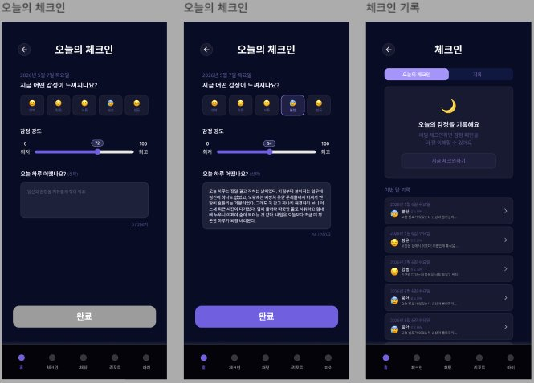

# 페이지 설계 — 체크인

> [← 인덱스로 돌아가기](./index.md)

**네비게이션:** `/(main)/checkin/index` + `/(main)/checkin/history`



---

## 오늘의 체크인 플로우

```
감정 선택 (이모지 5종)
  → 감정 강도 입력 (슬라이더 0~100)
  → 오늘 하루 어땠는지 텍스트 입력 (선택, 200자)
  → 완료 버튼
```

---

## 체크인 기록 화면

- 탭: 오늘의 체크인 | 기록
- 기록 목록: 날짜별 카드 (이모지 + 감정명 + 일기 미리보기)
- 미완료 상태: 달 일러스트 + "오늘의 감정을 기록하세요" CTA

---

## 주요 컴포넌트

```
CheckinScreen
  ├── CheckinHeader            # 날짜 + 요일
  ├── EmotionSelector          # 이모지 5종 선택 (happy/calm/neutral/anxious/tired)
  ├── IntensitySlider          # 0~100 슬라이더, 중앙 숫자 표시
  ├── DiaryTextInput           # 멀티라인 TextInput (200자 제한)
  └── CompleteButton

CheckinHistoryScreen
  ├── CheckinTabs              # 오늘의 체크인 | 기록
  ├── EmptyState               # 미체크인 시 달 일러스트
  └── CheckinHistoryList
       └── CheckinHistoryItem  # 날짜 + 이모지 + 감정 + 미리보기 텍스트
```

---

## 상태 관리 (Zustand)

#### `checkin/index.tsx`

| Store | 필드 / 액션 | R/W | 용도 |
|---|---|:---:|---|
| checkinStore | `currentStep` | R | 현재 입력 단계(`emotion` / `intensity` / `diary`) UI 전환 |
| checkinStore | `selectedEmotion` | R | `EmotionSelector` 선택 상태 표시 |
| checkinStore | `intensity` | R | `IntensitySlider` 현재 값 표시 |
| checkinStore | `diaryText` | R | `DiaryTextInput` 현재 텍스트 |
| checkinStore | `setEmotion()` | W | 이모지 선택 시 |
| checkinStore | `setIntensity()` | W | 슬라이더 드래그 시 |
| checkinStore | `setDiaryText()` | W | 텍스트 입력 시 |
| checkinStore | `nextStep()` | W | 단계 진행 버튼 탭 시 |
| checkinStore | `prevStep()` | W | 뒤로가기 탭 시 |
| checkinStore | `reset()` | W | `useMutation` 성공 콜백에서 호출 |

#### `checkin/history.tsx`

Zustand 의존 없음. TanStack Query(`useInfiniteQuery`)만 사용.

---

## 데이터 의존성 (TanStack Query)

```typescript
useQuery(['checkin', 'today'])               // 오늘 체크인 기록 조회 (완료 여부 + 선택 감정)
useInfiniteQuery(['checkin', 'history'])     // 과거 체크인 목록 (날짜 내림차순 페이지네이션)
useMutation(['checkin', 'create'])           // 체크인 저장 → 홈 today 캐시 무효화
```

---

## 관련 문서

- [상태 관리 설계](./07-state-management.md) — checkinStore 상세 인터페이스
- [공통 컴포넌트](./05-components.md) — IntensitySlider
