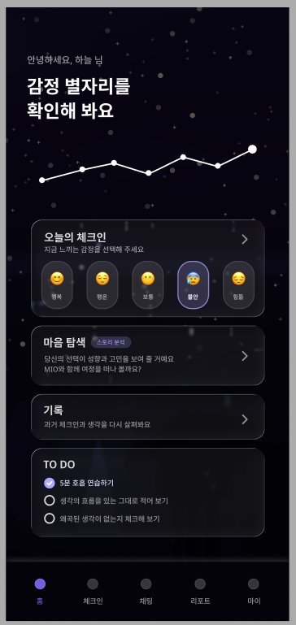

# 페이지 설계 — 홈

> [← 인덱스로 돌아가기](./index.md)

**네비게이션:** `/(main)/home/index`



---

## 구성 섹션

| 섹션 | 기능 |
|---|---|
| 헤더 | 유저 닉네임 + 인사 텍스트 |
| 감정 별자리 | 감정 데이터 기반 별 배치 애니메이션 (Reanimated) |
| 오늘의 체크인 | 미완료: 이모지 5개 선택 UI / 완료: 선택된 감정 강조 표시 → 체크인 화면 이동 |
| 마음 탐색 | 배지(스토리 분석 태그) + → 마음 탐색 진입 |
| 기록 | 과거 체크인/생각 리스트 미리보기 → 체크인 히스토리 이동 |
| TODO | 체크리스트 현황 표시 + 설정 이동 |

---

## 주요 컴포넌트

```
HomeScreen
  ├── HomeHeader               # "안녕하세요 {닉네임} 님" + 날짜
  ├── ConstellationView        # 별자리 SVG 애니메이션 + 꺾은선 그래프
  ├── TodayCheckinCard
  │   ├── EmotionQuickSelect   # 이모지 5개 (미완료 상태)
  │   └── CheckedEmotionBadge  # 완료된 감정 표시
  ├── MindExploreCard          # 마음 탐색 배너 카드
  ├── RecordPreviewCard        # 기록 미리보기
  └── TodoCard
       ├── TodoItem            # 체크박스 + 텍스트
       └── TodoSettingButton
```

---

## 상태 관리 (Zustand)

| Store | 필드 / 액션 | R/W | 용도 |
|---|---|:---:|---|
| authStore | `nickname` | R | `HomeHeader` — "안녕하세요 {닉네임} 님" |

> 나머지 홈 데이터(체크인 여부, 별자리, TODO)는 모두 TanStack Query로 처리.

---

## 데이터 의존성 (TanStack Query)

```typescript
useQuery(['home', 'checkin-today'])     // 오늘 체크인 여부
useQuery(['home', 'constellation'])     // 최근 7일 감정 데이터
useQuery(['home', 'todos'])             // TODO 목록
```

---

## 관련 문서

- [페이지 설계 — 체크인](./04-pages-checkin.md)
- [페이지 설계 — 마음 탐색](./04-pages-mind-explore.md)
- [공통 컴포넌트](./05-components.md)
