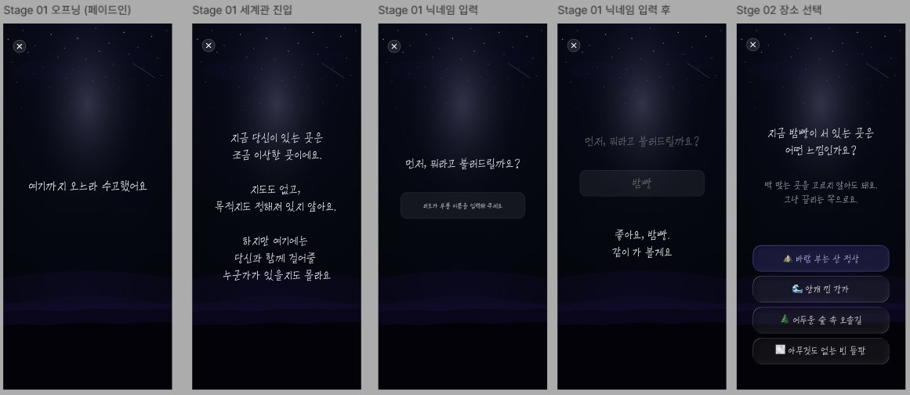

# 페이지 설계 — 마음 탐색

> [← 인덱스로 돌아가기](./index.md)

**진입:** 홈 → 마음 탐색 카드 탭  
**네비게이션:** 모달 스택 (`/mind-explore/`)



---

## 스테이지 플로우

| 스테이지 | 화면 | 설명 |
|---|---|---|
| Stage 01 | 오프닝 | 페이드인 텍스트 연출 |
| Stage 01 | 세계관 진입 | 분위기 설명 텍스트 |
| Stage 01 | 닉네임 입력 | 텍스트 인풋 |
| Stage 01 | 닉네임 확인 | "좋아요, {닉네임}, 같이 볼게요" |
| Stage 02 | 장소 선택 | 4개 선택지 카드 |
| ... | 이후 스테이지 | 분기별 스토리 진행 |
| 결과 | 결과 화면 | 어울리는 상담 캐릭터 추천 + 성향 분석 |

---

## 주요 컴포넌트

```
MindExploreScreen (오프닝)
  └── FadeInText               # 연속 텍스트 페이드인 애니메이션

StageScreen
  ├── StageNarration           # 스토리 텍스트
  ├── NicknameInput            # 닉네임 입력 스테이지
  └── ChoiceList
       └── ChoiceCard          # 선택지 버튼

ResultScreen
  ├── CharacterRecommendCard   # 추천 캐릭터 + 이유
  ├── PersonalityAnalysis      # 성향 분석 텍스트
  └── ActionButtons            # 이 캐릭터로 시작하기 / 닫기
```

---

## 상태 관리 (Zustand)

```typescript
// mindExploreStore
interface MindExploreState {
  sessionId: string
  nickname: string
  currentStageId: string
  choices: Record<string, string>  // stageId: choiceId
  result: MindExploreResult | null
}
```

### 페이지별 Store 의존성

#### `mind-explore/index.tsx` — 오프닝

| Store | 필드 / 액션 | R/W | 용도 |
|---|---|:---:|---|
| mindExploreStore | `reset()` | W | 탐색 진입 시 이전 세션 초기화 |
| mindExploreStore | `initSession()` | W | 새 세션 ID 발급 후 저장 |

#### `mind-explore/[stageId].tsx`

| Store | 필드 / 액션 | R/W | 용도 |
|---|---|:---:|---|
| mindExploreStore | `sessionId` | R | mutation 페이로드 / 결과 쿼리 키 |
| mindExploreStore | `nickname` | R | 스토리 텍스트 보간 `"좋아요, {nickname}, 같이 볼게요"` |
| mindExploreStore | `currentStageId` | R | 현재 스테이지 확인 |
| mindExploreStore | `choices` | R | 이미 선택한 선택지 강조 표시 (이전 스테이지 복귀 시) |
| mindExploreStore | `setNickname()` | W | 닉네임 입력 스테이지에서 텍스트 확정 시 |
| mindExploreStore | `setChoice()` | W | 선택지 카드 탭 시 |
| mindExploreStore | `setCurrentStage()` | W | 다음 스테이지로 분기 이동 시 |

#### `mind-explore/result.tsx`

| Store | 필드 / 액션 | R/W | 용도 |
|---|---|:---:|---|
| mindExploreStore | `sessionId` | R | `useQuery(['mind-explore', 'result', sessionId])` 쿼리 키 |
| mindExploreStore | `result` | R | 추천 캐릭터 + 성향 분석 표시 (서버 응답 후 저장된 값) |
| mindExploreStore | `setResult()` | W | 결과 쿼리 성공 시 스토어에 캐시 |
| mindExploreStore | `reset()` | W | 닫기 버튼 탭 시 세션 초기화 |

---

## 데이터 의존성 (TanStack Query)

```typescript
useQuery(['mind-explore', 'stages'])                   // 스테이지 시나리오 데이터 (정적, staleTime: Infinity)
useMutation(['mind-explore', 'session', 'submit'])     // 선택 제출 → 다음 스테이지 분기 응답
useQuery(['mind-explore', 'result', sessionId])        // 최종 결과 조회 (추천 캐릭터 + 성향 분석)
```

---

## 관련 문서

- [네비게이션 구조](./03-navigation.md)
- [상태 관리 설계](./07-state-management.md) — mindExploreStore 상세 인터페이스
