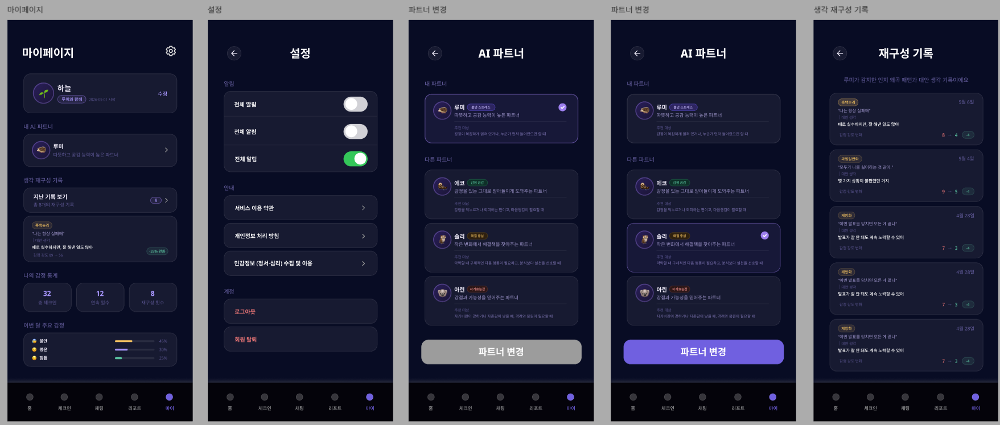

# 페이지 설계 — 마이페이지

> [← 인덱스로 돌아가기](./index.md)

**네비게이션:** `/(main)/my/index` + `/(main)/my/settings` + `/(main)/my/partner` + `/(main)/my/records`



---

## 마이페이지 메인 기능

| 기능 | 설명 |
|---|---|
| 프로필 카드 | 닉네임 + 현재 파트너 아바타 + "수정" 버튼으로 프로필 편집 진입 |
| AI 파트너 섹션 | 현재 선택된 AI 파트너 한줄 소개 카드 |
| 생각 재구성 기록 프리뷰 | 최근 기록 1건 축약 노출 + "지난 기록 보기" → records 화면 진입 |
| 감정 통계 | 대화·체크인·재구성 기록 수 요약 숫자 + 감정 분포 수평 막대 차트 |
| 설정 진입 | 상단 우측 ⚙ 아이콘 탭 → settings 화면 이동 |

---

## 설정 화면 구성

```
SettingsScreen
  ├── SettingsHeader             # ← 뒤로가기 + "설정" 제목
  ├── NotificationSection        # 알림
  │   ├── AllNotificationToggle  # 전체 알림
  │   ├── CheckInToggle          # 체크인 알림
  │   └── ChatToggle             # 채팅 알림
  ├── InfoSection                # 안내
  │   ├── TermsRow               # 서비스 이용약관 >
  │   ├── PrivacyRow             # 개인정보 처리방침 >
  │   └── LegalConsentRow        # 개인정보(법적 심의) 수집 및 이용 >
  └── AccountSection             # 계정
       ├── LogoutButton          # 로그아웃 (위험 색상)
       └── DeleteAccountButton   # 회원 탈퇴 (위험 색상)
```

---

## 파트너 변경 화면 구성

```
PartnerScreen
  ├── PartnerHeader              # ← 뒤로가기 + "AI 파트너" 제목
  ├── CurrentPartnerSection      # "내 파트너" — 현재 파트너 강조 테두리로 표시
  ├── OtherPartnerList           # "다른 파트너" 목록
  │   └── PartnerCard × N       # 캐릭터 아바타 + 이름 + 태그 + 한줄 소개 + 선택 라디오
  └── ChangePartnerButton        # "파트너 변경" 버튼
                                 # 현재와 동일 파트너 선택 시 비활성(gray)
                                 # 다른 파트너 선택 시 활성(purple)
```

---

## 재구성 기록 화면 구성

```
RecordsScreen
  ├── RecordsHeader              # ← 뒤로가기 + "재구성 기록" 제목
  └── RecordList                 # 기록 목록 (최신순)
       └── RecordItem × N       # 날짜 + 원래 생각 인용 + 감정 반응(좋아·싫어) 카운트
```

---

## 주요 컴포넌트

```
MyScreen
  ├── MyHeader                   # "마이페이지" 제목 + ⚙ 아이콘 (→ settings)
  ├── ProfileCard                # 파트너 아바타 + 닉네임 + "수정" 버튼
  ├── PartnerPreviewCard         # 현재 AI 파트너 이름 + 한줄 소개
  ├── RecordPreviewSection
  │   ├── RecordPreviewHeader    # "생각 재구성 기록" 라벨 + "지난 기록 보기 →" 버튼
  │   └── RecordPreviewItem      # 최근 기록 1건 (원래 생각 축약 + 감정 반응)
  └── EmotionStatsSection
       ├── StatNumberRow         # 대화 횟수 · 체크인 수 · 재구성 기록 수 (3개 숫자)
       └── EmotionBarChart       # 감정 분포 수평 막대 차트

SettingsScreen
  ├── NotificationSection
  │   ├── AllNotificationToggle
  │   ├── CheckInToggle
  │   └── ChatToggle
  ├── InfoSection
  │   ├── TermsRow
  │   ├── PrivacyRow
  │   └── LegalConsentRow
  └── AccountSection
       ├── LogoutButton
       └── DeleteAccountButton

PartnerScreen
  ├── CurrentPartnerCard         # 선택된 상태 강조 (보라색 테두리)
  ├── PartnerCard × N            # 태그(예: 활발함·따뜻함) + 한줄 소개
  └── ChangePartnerButton

RecordsScreen
  └── RecordItem                 # 날짜 + 인용 텍스트 + 좋아·싫어 버튼 + 카운트
```

---

## 상태 관리 (Zustand)

#### `my/index.tsx`

| Store | 필드 / 액션 | R/W | 용도 |
|---|---|:---:|---|
| authStore | `nickname` | R | `ProfileCard` 닉네임 표시 |
| authStore | `logout()` | W | 로그아웃 `useMutation` 성공 콜백에서 호출 |

#### `my/partner.tsx`

| Store | 필드 / 액션 | R/W | 용도 |
|---|---|:---:|---|
| partnerStore | `selectedPartnerId` | R/W | 목록에서 선택 시 임시 상태 저장, 변경 확정 전까지 로컬 유지 |

#### `my/settings.tsx`

Zustand 의존 없음. 알림 토글 상태는 TanStack Query 서버 상태를 직접 반영.

#### `my/records.tsx`

Zustand 의존 없음.

---

## 데이터 의존성 (TanStack Query)

```typescript
useQuery(['my', 'profile'])                  // 닉네임 + 현재 파트너 + 감정 통계 숫자
useQuery(['my', 'partner', 'list'])          // 선택 가능한 파트너 전체 목록
useQuery(['my', 'settings'])                 // 알림 설정 (전체·체크인·채팅 토글 상태)
useQuery(['my', 'records'])                  // 재구성 기록 목록 (최신순)
useMutation(['my', 'partner', 'update'])     // 파트너 변경 → ['my', 'profile'] 캐시 무효화
useMutation(['my', 'settings', 'update'])    // 알림 설정 토글 변경
useMutation(['my', 'account', 'logout'])     // 로그아웃 → 전체 쿼리 캐시 초기화
useMutation(['my', 'account', 'delete'])     // 회원 탈퇴 → 세션·캐시 전체 초기화
```

---

## 관련 문서

- [상태 관리 설계](./07-state-management.md) — authStore 상세 인터페이스
- [채팅 페이지 설계](./04-pages-chat.md) — 재구성 기록과 연동되는 생각 재구성 플로우
