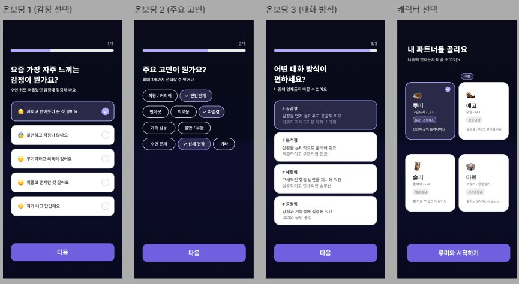

# 페이지 설계 — 온보딩

> [← 인덱스로 돌아가기](./index.md)

**진입 조건:** 최초 가입 시 1회만 진행. 완료 후 홈으로 리다이렉트.



---

## 스텝 구성

| 스텝 | 화면명 | 핵심 UI | 선택 방식 |
|---|---|---|---|
| 1/3 | 감정 선택 | 감정 목록 라디오 | 단일 선택 |
| 2/3 | 주요 고민 | 칩(Chip) 목록 | 최대 3개 다중 선택 |
| 3/3 | 대화 방식 | 카드 선택 | 단일 선택 (공감형/분석형/해결형/균형형) |
| - | 캐릭터 선택 | 캐릭터 카드 그리드 | 단일 선택 + 확인 버튼 |

---

## 주요 컴포넌트

```
OnboardingLayout
  ├── ProgressBar              # 1/3, 2/3, 3/3 표시
  ├── StepQuestion             # 질문 텍스트 + 서브 설명
  ├── EmotionRadioList         # 스텝 1 - 이모지 + 감정 라디오
  ├── ConcernChipGroup         # 스텝 2 - 선택 칩 (max 3)
  ├── ConversationStyleCard    # 스텝 3 - 해시태그 + 설명 카드
  └── CharacterSelectGrid      # 캐릭터 카드 (이름, 유형, 설명)
```

---

## 상태 관리 (Zustand)

```typescript
// onboardingStore
interface OnboardingState {
  emotion: string | null
  concerns: string[]         // max 3
  conversationStyle: 'empathy' | 'analysis' | 'solution' | 'balanced' | null
  selectedCharacter: CharacterId | null
  currentStep: 1 | 2 | 3 | 4
}
```

### 페이지별 Store 의존성

#### `step1-emotion.tsx`

| Store | 필드 / 액션 | R/W | 용도 |
|---|---|:---:|---|
| onboardingStore | `emotion` | R | 선택된 감정 라디오 강조 표시 |
| onboardingStore | `currentStep` | R | ProgressBar `1/3` 표시 |
| onboardingStore | `setEmotion()` | W | 감정 라디오 선택 시 |
| onboardingStore | `nextStep()` | W | 다음 버튼 탭 시 |

#### `step2-concern.tsx`

| Store | 필드 / 액션 | R/W | 용도 |
|---|---|:---:|---|
| onboardingStore | `concerns` | R | 선택된 칩 강조 표시 / 최대 3개 카운트 |
| onboardingStore | `currentStep` | R | ProgressBar `2/3` 표시 |
| onboardingStore | `toggleConcern()` | W | 칩 선택·해제 시 |
| onboardingStore | `nextStep()` | W | 다음 버튼 탭 시 |
| onboardingStore | `prevStep()` | W | 뒤로가기 버튼 탭 시 |

#### `step3-style.tsx`

| Store | 필드 / 액션 | R/W | 용도 |
|---|---|:---:|---|
| onboardingStore | `conversationStyle` | R | 선택된 대화 방식 카드 강조 표시 |
| onboardingStore | `currentStep` | R | ProgressBar `3/3` 표시 |
| onboardingStore | `setConversationStyle()` | W | 대화 방식 카드 선택 시 |
| onboardingStore | `nextStep()` | W | 다음 버튼 탭 시 |
| onboardingStore | `prevStep()` | W | 뒤로가기 버튼 탭 시 |

#### `step4-character.tsx`

| Store | 필드 / 액션 | R/W | 용도 |
|---|---|:---:|---|
| onboardingStore | `selectedCharacter` | R | 선택된 캐릭터 카드 강조 표시 |
| onboardingStore | `emotion`, `concerns`, `conversationStyle` | R | 서버 저장 mutation 페이로드 조합 |
| onboardingStore | `setCharacter()` | W | 캐릭터 카드 선택 시 |
| onboardingStore | `reset()` | W | `useMutation` 성공 콜백에서 호출 (스토어 초기화) |

---

## 데이터 의존성 (TanStack Query)

```typescript
useQuery(['characters'])                  // 캐릭터 목록 (정적 데이터, staleTime: Infinity)
useMutation(['onboarding', 'submit'])     // 온보딩 완료 → 서버 저장 후 홈 리다이렉트
```

---

## 관련 문서

- [네비게이션 구조](./03-navigation.md)
- [상태 관리 설계](./07-state-management.md) — onboardingStore 상세 인터페이스
- [공통 컴포넌트](./05-components.md)
