# 컴포넌트 트리 + 데이터 의존성

> 자동 생성: 2026-05-07  
> 소스: 01~07 설계 문서 전체 참조

## 범례

| 색상/모양 | 의미 |
|---|---|
| 파란 직사각형 | Screen / Page |
| 초록 둥근 사각형 | UI 컴포넌트 |
| 보라 이중 테두리 | 공통 컴포넌트 (components/) |
| 노란 깃발 | TanStack Query (조회) |
| 주황 깃발 | TanStack Mutation (저장 · 전송) |
| `-->` | 컴포넌트 포함 / 화면 이동 |
| `-.->` | 데이터 의존성 (Query / Mutation) |

---

## 다이어그램
https://mermaid.ai/d/f7903f42-e023-42dc-8e34-62b31ad733bd

```mermaid
flowchart TD
    classDef screen   fill:#0d3358,stroke:#4a9eff,color:#fff,font-weight:bold
    classDef comp     fill:#0d3d1f,stroke:#4aff8f,color:#fff
    classDef shared   fill:#2a1f4f,stroke:#9f9fff,color:#fff
    classDef query    fill:#3a2900,stroke:#ffd166,color:#fff
    classDef mutation fill:#2a1500,stroke:#ff9545,color:#fff

    %% ══════════════════════════════════════════
    %% 공통 컴포넌트 (참조용 — 화살표 없음)
    %% ══════════════════════════════════════════
    subgraph SG_SHARED[" 공통 컴포넌트 (components/) "]
        direction LR
        SH_btn[["Button"]]:::shared
        SH_input[["TextInput · MultilineInput"]]:::shared
        SH_glass[["GlassCard"]]:::shared
        SH_slider[["IntensitySlider"]]:::shared
        SH_avatar[["CharacterAvatar"]]:::shared
        SH_emoji[["EmotionEmoji"]]:::shared
        SH_layout[["ScreenContainer · StarBackground"]]:::shared
    end

    %% ══════════════════════════════════════════
    %% 앱 루트
    %% ══════════════════════════════════════════
    ROOT["app/_layout.tsx<br/>로그인 여부에 따라 auth / main 분기"]:::screen
    G_auth["(auth)/ 그룹"]
    G_main["(main)/ Bottom Tab Navigator"]
    G_mind["mind-explore/ 모달 스택"]
    ROOT --> G_auth & G_main & G_mind

    %% ══════════════════════════════════════════
    %% (auth)/
    %% ══════════════════════════════════════════
    subgraph SG_AUTH["(auth)/"]
        L_login["login.tsx"]:::screen

        subgraph SG_OB["onboarding/"]
            OB_s1["step1-emotion.tsx"]:::screen
            OB_s2["step2-concern.tsx"]:::screen
            OB_s3["step3-style.tsx"]:::screen
            OB_s4["step4-character.tsx"]:::screen

            OB_layout("OnboardingLayout"):::comp
            OB_prog("ProgressBar"):::comp
            OB_stepq("StepQuestion"):::comp
            OB_emorad("EmotionRadioList"):::comp
            OB_chip("ConcernChipGroup<br/>최대 3개 선택"):::comp
            OB_conv("ConversationStyleCard"):::comp
            OB_grid("CharacterSelectGrid"):::comp

            OB_s1 --> OB_layout & OB_emorad
            OB_s2 --> OB_layout & OB_chip
            OB_s3 --> OB_layout & OB_conv
            OB_s4 --> OB_grid
            OB_layout --> OB_prog & OB_stepq

            Q_chars>"캐릭터 목록"]:::query
            M_onboard>"온보딩 저장 → 홈 이동"]:::mutation
            OB_s4 -.-> Q_chars
            OB_s4 -.-> M_onboard
        end
    end

    G_auth --> L_login & OB_s1

    %% ══════════════════════════════════════════
    %% (main)/home/
    %% ══════════════════════════════════════════
    subgraph SG_HOME["(main)/home/"]
        H_screen["HomeScreen"]:::screen
        H_hdr("HomeHeader<br/>닉네임 + 날짜"):::comp
        H_const("ConstellationView<br/>최근 7일 별자리 SVG"):::comp
        H_today("TodayCheckinCard"):::comp
        H_eqs("EmotionQuickSelect<br/>이모지 5개 — 미완료 상태"):::comp
        H_badge("CheckedEmotionBadge<br/>완료된 감정 강조"):::comp
        H_mind("MindExploreCard<br/>마음탐색 배너"):::comp
        H_rec("RecordPreviewCard<br/>기록 미리보기"):::comp
        H_todo("TodoCard"):::comp
        H_titem("TodoItem<br/>체크박스 + 텍스트"):::comp
        H_tsettingbtn("TodoSettingButton"):::comp

        H_screen --> H_hdr & H_const & H_today & H_mind & H_rec & H_todo
        H_today --> H_eqs & H_badge
        H_todo  --> H_titem & H_tsettingbtn

        Q_htoday>"오늘 체크인 완료 여부"]:::query
        Q_hconst>"별자리 감정 데이터 (7일)"]:::query
        Q_htodo>"TODO 목록"]:::query
        H_screen -.-> Q_htoday
        H_screen -.-> Q_hconst
        H_screen -.-> Q_htodo
    end

    G_main --> H_screen

    %% ══════════════════════════════════════════
    %% (main)/checkin/
    %% ══════════════════════════════════════════
    subgraph SG_CI["(main)/checkin/"]
        CI_screen["checkin/index.tsx"]:::screen
        CI_hdr("CheckinHeader<br/>날짜 + 요일"):::comp
        CI_emo("EmotionSelector<br/>happy · calm · neutral · anxious · tired"):::comp
        CI_sld("IntensitySlider<br/>감정 강도 0~100"):::comp
        CI_diary("DiaryTextInput<br/>최대 200자"):::comp
        CI_done("CompleteButton"):::comp

        HI_screen["checkin/history.tsx"]:::screen
        HI_tabs("CheckinTabs<br/>오늘의 체크인 | 기록"):::comp
        HI_empty("EmptyState<br/>달 일러스트 + CTA"):::comp
        HI_list("CheckinHistoryList"):::comp
        HI_item("CheckinHistoryItem<br/>날짜 + 이모지 + 감정 + 미리보기"):::comp

        CI_screen --> CI_hdr & CI_emo & CI_sld & CI_diary & CI_done
        HI_screen --> HI_tabs & HI_empty & HI_list
        HI_list   --> HI_item

        Q_ctoday>"오늘 체크인 완료 여부"]:::query
        M_ci>"체크인 저장"]:::mutation
        Q_chist>"체크인 기록 (무한스크롤)"]:::query
        CI_screen -.-> Q_ctoday
        CI_screen -.-> M_ci
        HI_screen -.-> Q_chist
    end

    G_main --> CI_screen & HI_screen

    %% ══════════════════════════════════════════
    %% (main)/chat/
    %% ══════════════════════════════════════════
    subgraph SG_CHAT["(main)/chat/"]
        CH_screen["chat/index.tsx"]:::screen
        CH_hdr("ChatHeader<br/>캐릭터명 + 온라인 표시"):::comp
        CH_list("ChatMessageList<br/>FlatList 역방향"):::comp
        CH_tbub("TextBubble<br/>사용자 / AI 버블"):::comp
        CH_rpc("RestructurePromptCard<br/>인지왜곡 감지 → 재구성 제안"):::comp
        CH_eic("EmotionIntensityCard<br/>감정강도 슬라이더 인라인"):::comp
        CH_typing("TypingIndicator<br/>3점 애니메이션"):::comp
        CH_input("ChatInput"):::comp
        CH_send("SendButton"):::comp

        RST_screen["chat/restructure.tsx"]:::screen
        RST_orig("OriginalThoughtCard<br/>사용자 발화 인용"):::comp
        RST_q("CharacterQuestionCard<br/>CBT 질문"):::comp
        RST_alt("AlternativeThoughtCard<br/>AI 대안 생각"):::comp
        RST_sld("IntensitySlider<br/>변화 후 감정 강도"):::comp
        RST_save("SaveButton<br/>변화 저장하기"):::comp

        CH_screen  --> CH_hdr & CH_list & CH_typing & CH_input
        CH_list    --> CH_tbub & CH_rpc & CH_eic
        CH_input   --> CH_send
        RST_screen --> RST_orig & RST_q & RST_alt & RST_sld & RST_save

        Q_chatchar>"캐릭터 정보 (이름 · 아바타)"]:::query
        Q_chatmsg>"대화 히스토리 (무한스크롤)"]:::query
        M_chatsend>"메시지 전송 (SSE 스트리밍)"]:::mutation
        M_rst>"인지재구성 결과 저장"]:::mutation
        CH_screen  -.-> Q_chatchar
        CH_screen  -.-> Q_chatmsg
        CH_screen  -.-> M_chatsend
        RST_screen -.-> M_rst
    end

    G_main --> CH_screen & RST_screen

    %% ══════════════════════════════════════════
    %% (main)/report/
    %% ══════════════════════════════════════════
    subgraph SG_RPT["(main)/report/"]
        RPT_screen["ReportScreen"]:::screen
        RPT_hdr("ReportHeader"):::comp
        RPT_tab("PeriodTabBar<br/>주간 | 월간 | 3개월 | 전체"):::comp
        RPT_trend("EmotionTrendChart<br/>기간별 감정강도 꺾은선"):::comp
        RPT_empty("EmptyChartState<br/>데이터 없을 때"):::comp
        RPT_trig("TriggerTopList"):::comp
        RPT_titem("TriggerItem<br/>순위 + 트리거명 + % 바"):::comp
        RPT_story("CharacterWeeklyStory<br/>AI 주간 요약"):::comp

        RPT_screen --> RPT_hdr & RPT_tab & RPT_trend & RPT_trig & RPT_story
        RPT_trend  --> RPT_empty
        RPT_trig   --> RPT_titem

        Q_rtrend>"감정강도 추이 (선택 기간)"]:::query
        Q_rtrig>"트리거 TOP3 (선택 기간)"]:::query
        Q_rstory>"AI 주간 이야기"]:::query
        RPT_screen -.-> Q_rtrend
        RPT_screen -.-> Q_rtrig
        RPT_screen -.-> Q_rstory
    end

    G_main --> RPT_screen

    %% ══════════════════════════════════════════
    %% (main)/my/
    %% ══════════════════════════════════════════
    subgraph SG_MY["(main)/my/"]
        MY_screen["my/index.tsx"]:::screen
        MY_prof("ProfileCard<br/>닉네임 + 파트너 캐릭터"):::comp
        MY_setsec("SettingSection"):::comp
        MY_partrow("PartnerChangeRow"):::comp
        MY_notirow("NotificationRow<br/>알림 토글"):::comp
        MY_accsec("AccountSection<br/>로그아웃 · 탈퇴"):::comp
        MY_appinfo("AppInfoSection<br/>버전 · 약관"):::comp
        MY_partner["my/partner.tsx"]:::screen
        MY_settings["my/settings.tsx"]:::screen

        MY_screen  --> MY_prof & MY_setsec & MY_appinfo
        MY_setsec  --> MY_partrow & MY_notirow & MY_accsec
        MY_partrow --> MY_partner

        Q_myprof>"유저 프로필 + 파트너 캐릭터"]:::query
        Q_myset>"알림 설정 (체크인 리마인더 · 채팅)"]:::query
        M_partner>"파트너 캐릭터 변경"]:::mutation
        M_logout>"로그아웃 + 전체 캐시 초기화"]:::mutation
        MY_screen   -.-> Q_myprof
        MY_screen   -.-> M_logout
        MY_settings -.-> Q_myset
        MY_partner  -.-> M_partner
    end

    G_main --> MY_screen

    %% ══════════════════════════════════════════
    %% mind-explore/ 모달 스택
    %% ══════════════════════════════════════════
    subgraph SG_MIND["mind-explore/ 모달 스택"]
        ME_open["mind-explore/index.tsx<br/>오프닝"]:::screen
        ME_fade("FadeInText<br/>연속 텍스트 페이드인"):::comp

        ME_stage["mind-explore/[stageId].tsx"]:::screen
        ME_narr("StageNarration<br/>스토리 텍스트"):::comp
        ME_nick("NicknameInput"):::comp
        ME_clist("ChoiceList"):::comp
        ME_ccard("ChoiceCard<br/>선택지 버튼"):::comp

        ME_result["mind-explore/result.tsx"]:::screen
        ME_rec("CharacterRecommendCard<br/>추천 캐릭터 + 이유"):::comp
        ME_anal("PersonalityAnalysis<br/>성향 분석 텍스트"):::comp
        ME_act("ActionButtons<br/>이 캐릭터로 시작하기 / 닫기"):::comp

        ME_open   --> ME_fade
        ME_stage  --> ME_narr & ME_nick & ME_clist
        ME_clist  --> ME_ccard
        ME_result --> ME_rec & ME_anal & ME_act

        Q_mstage>"스테이지 시나리오 (정적)"]:::query
        M_mstage>"선택 제출 → 다음 스테이지 분기"]:::mutation
        Q_mresult>"캐릭터 추천 결과"]:::query
        ME_open   -.-> Q_mstage
        ME_stage  -.-> M_mstage
        ME_result -.-> Q_mresult
    end

    G_mind --> ME_open & ME_stage & ME_result
```

---

## 공통 컴포넌트 사용처

| 공통 컴포넌트 | 사용 화면 |
|---|---|
| `Button` | 온보딩 · 홈 · 체크인 · 채팅 · 리포트 · 마이 · 마음탐색 |
| `TextInput · MultilineInput` | 온보딩 · 체크인(DiaryTextInput) · 채팅(ChatInput) · 마음탐색(NicknameInput) |
| `GlassCard` | 온보딩 · 홈 · 체크인 · 채팅 · 리포트 · 마음탐색 |
| `IntensitySlider` | 체크인(강도 입력) · 채팅(EmotionIntensityCard · RestructureScreen) |
| `CharacterAvatar` | 온보딩 · 채팅(ChatHeader) · 리포트(WeeklyStory) · 마이(ProfileCard) · 마음탐색(ResultScreen) |
| `EmotionEmoji` | 온보딩(EmotionRadioList) · 홈(EmotionQuickSelect) · 체크인(EmotionSelector) |
| `ScreenContainer · StarBackground` | 모든 화면 공통 래퍼 |

---

## TanStack Query 캐시 전략

| 쿼리 키 | staleTime | 비고 |
|---|---|---|
| `['characters']` | Infinity | 정적 데이터 |
| `['mind-explore','stages']` | Infinity | 정적 시나리오 |
| `['home','checkin-today']` | 5분 | 체크인 저장 후 무효화 |
| `['report', period, *]` | 10분 | 기간별 캐시 분리 |
| `['chat','messages']` | 0 | 항상 최신 유지 |
| `['my','profile']` | 기본값 | 파트너 변경 후 무효화 |
